# Mimir: The Multi-Project Knowledge Base System That Thinks Beyond Documentation

## Introduction

Managing knowledge across multiple projects is one of the most underrated challenges in software development. Every project accumulates documentation, architectural decisions, code patterns, and tribal knowledge. But what happens when you need to share that knowledge across projects? Or when an AI assistant needs to understand the context of your entire codebase?

**Mimir** solves this problem elegantly. It's a centralized, multi-project knowledge base system that uses LlamaIndex for semantic document indexing and MCP (Model Context Protocol) for seamless integration with AI tools like OpenCode. Install it once, use it in any project directory with automatic workspace detection.

In this post, we'll dive deep into Mimir's architecture, explore how it works under the hood, and demonstrate its power through real-world examples.

---

## The Problem: Knowledge Silos in Multi-Project Workflows

Before Mimir, knowledge management in multi-project environments looked like this:

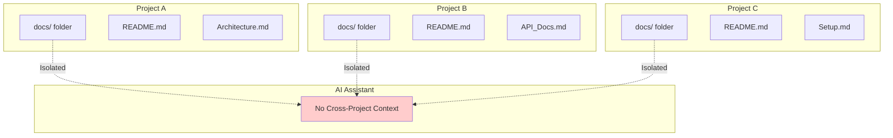

**The Pain Points:**
- ❌ **Duplicated documentation**: Same concepts explained differently in each project
- ❌ **Context switching overhead**: AI assistants lack awareness of patterns across projects
- ❌ **Manual setup required**: Each project needs its own knowledge base configuration
- ❌ **No semantic search**: Keyword-based search misses relevant context
- ❌ **Vendor lock-in**: Tied to specific AI platforms or embedding providers

---

## The Solution: Mimir's Unified Architecture

Mimir introduces a **centralized-yet-isolated** architecture that provides the best of both worlds:

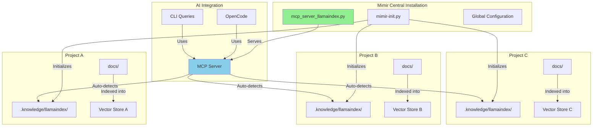

**Key Architectural Principles:**

1. **📍 Centralized Server**: One `mcp_server_llamaindex.py` serves all projects
2. **🔒 Per-Project Isolation**: Each project has its own vector store in `.knowledge/llamaindex/`
3. **🎯 Workspace Auto-Detection**: Automatically detects project root via markers (`.git/`, `.opencode/`, etc.)
4. **🔗 MCP Protocol**: Standardized integration with AI assistants
5. **☁️ OpenRouter Support**: No OpenAI key required, uses OpenRouter for embeddings

---

## Deep Dive: How Mimir Works

### 1. Project Detection and Initialization

When you run `mimir-init.py` in any directory, Mimir performs intelligent project detection:

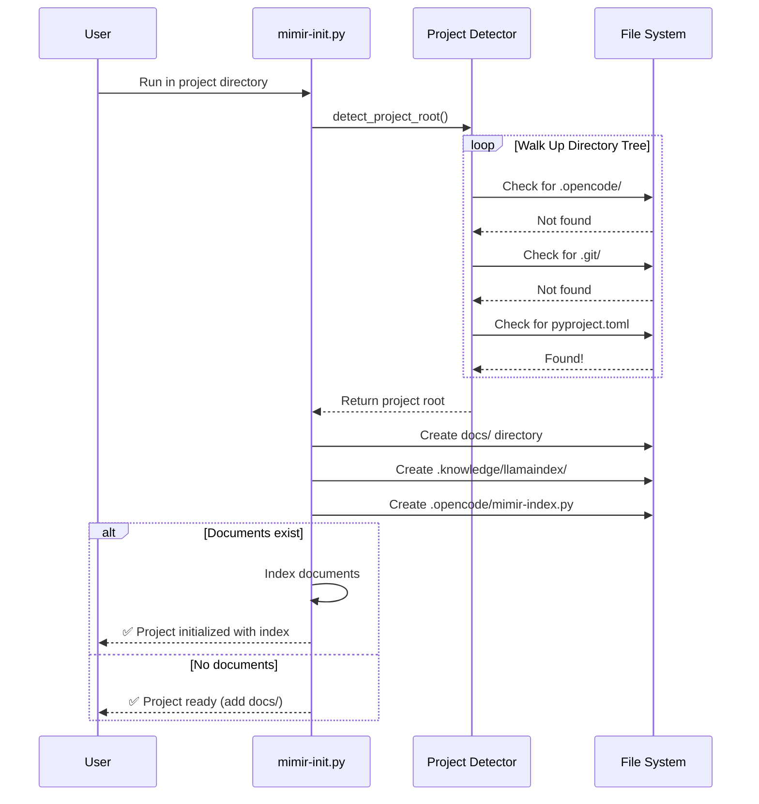

**Detection Hierarchy:**
1. Check environment variables (`PROJECT_ROOT`, `WORKSPACE_FOLDER`, `VSCODE_CWD`)
2. Walk up directory tree looking for markers:
   - `.opencode/` - OpenCode workspace
   - `opencode.json` - OpenCode config
   - `.git/` - Git repository
   - `pyproject.toml` - Python project
   - `package.json` - Node.js project
   - `Cargo.toml` - Rust project
3. Fall back to current working directory

### 2. Document Indexing Pipeline

Mimir uses LlamaIndex to create a semantic search index:

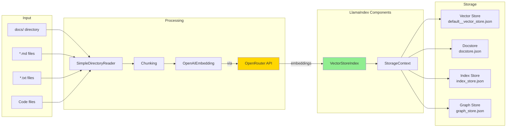

**The Indexing Process:**

1. **Document Loading**: `SimpleDirectoryReader` recursively loads all files from `docs/`
2. **Text Chunking**: Documents are split into manageable chunks for embedding
3. **Embedding Generation**: Each chunk is converted to a vector using OpenRouter's embedding API
4. **Index Construction**: LlamaIndex builds a `VectorStoreIndex` with the embeddings
5. **Persistence**: The index is saved to `.knowledge/llamaindex/` with four components:
   - `default__vector_store.json` - Vector embeddings
   - `docstore.json` - Document metadata and content
   - `index_store.json` - Index structure mapping
   - `graph_store.json` - Relationship graph (for advanced queries)

### 3. The MCP Server Architecture

The heart of Mimir is its MCP (Model Context Protocol) server:

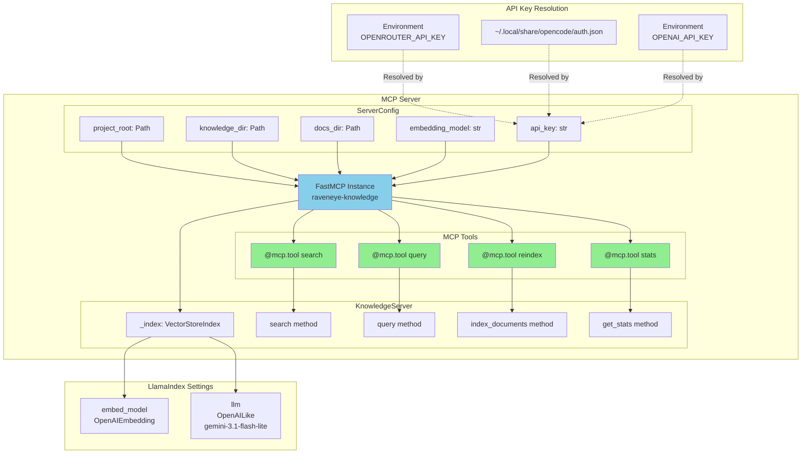

**MCP Tools Exposed:**

| Tool | Purpose | Parameters |
|------|---------|------------|
| `search(query, top_k=5)` | Semantic similarity search | Query string, number of results |
| `query(question)` | Natural language Q&A | Question string |
| `reindex()` | Rebuild knowledge base from docs | None |
| `stats()` | Get knowledge base statistics | None |

### 4. Request Flow: From Query to Answer

When you ask a question through the MCP server, here's what happens:

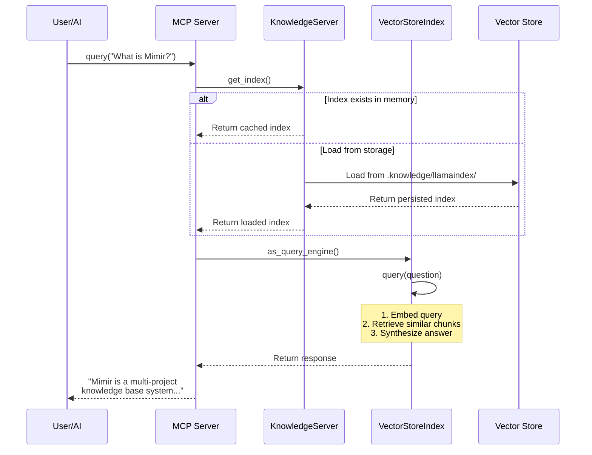

**The Query Process:**

1. **Index Retrieval**: The server checks if the index is loaded, loading from disk if necessary
2. **Query Embedding**: The question is converted to a vector embedding
3. **Similarity Search**: The index retrieves the most similar document chunks
4. **Answer Synthesis**: LlamaIndex's query engine synthesizes a coherent answer
5. **Response**: The answer is returned through the MCP protocol

---

## Deep Dive: How Vector Databases and Semantic Search Work

To truly understand Mimir, you need to understand the technology powering it: **vector databases** and **semantic search**. These concepts are what make Mimir fundamentally different from traditional keyword search.

### What is a Vector Database?

A vector database stores data as **vectors** (arrays of numbers) rather than raw text. Think of it as a library where instead of organizing books alphabetically, you organize them by meaning.

```
Traditional Database:        Vector Database:
┌─────────────────┐         ┌─────────────────────────────┐
│ Title           │         │ Content    │ Vector (384-d) │
├─────────────────┤         ├────────────┼────────────────┤
│ "Cat Care"      │         │ Cat guide  │ [0.23, -0.87,  │
│ "Dog Training"  │         │            │  0.15, ...]    │
│ "Kitten Health" │         ├────────────┼────────────────┤
└─────────────────┘         │ Dog guide  │ [-0.45, 0.62,  │
                            │            │  0.91, ...]    │
                            ├────────────┼────────────────┤
                            │ Kitten doc │ [0.25, -0.89,  │
                            │            │  0.12, ...]    │
                            └─────────────────────────────┘
```

**Key insight**: "Cat Care" and "Kitten Health" have similar vectors because they mean similar things, even though they use different words!

### How Text Becomes Vectors: Embedding Models

An **embedding model** (like OpenAI's `text-embedding-3-small`) converts text into vectors using deep learning. Here's how it works:

```
Input Text: "The quick brown fox jumps over the lazy dog"
                    ↓
         [Embedding Model: Neural Network]
                    ↓
Output Vector: [0.12, -0.45, 0.89, -0.23, 0.67, ...] 
               (384 numbers for text-embedding-3-small)
```

**The Magic**: Similar concepts produce similar vectors, regardless of the exact words used.

| Text 1 | Text 2 | Similarity | Why? |
|--------|--------|------------|------|
| "How do I authenticate?" | "What's the login process?" | 0.94 | Same meaning, different words |
| "Authentication" | "Authorization" | 0.72 | Related but different concepts |
| "Authentication" | "Pizza recipe" | 0.08 | Completely unrelated |

### Semantic Search vs Keyword Search

Here's why semantic search is revolutionary:

```
Query: "How do I log in?"

┌─────────────────────────────────────────────────────────────────┐
│                    KEYWORD SEARCH                               │
├─────────────────────────────────────────────────────────────────┤
│ Documents with "log" OR "login" OR "in":                        │
│  ✅ "The login function accepts credentials"                    │
│  ✅ "Log in to access your account"                             │
│  ❌ "Authentication requires valid tokens"                      │
│  ❌ "Sign in with your username"                                │
└─────────────────────────────────────────────────────────────────┘

┌─────────────────────────────────────────────────────────────────┐
│                   SEMANTIC SEARCH                               │
├─────────────────────────────────────────────────────────────────┤
│ Documents with SIMILAR MEANING:                                 │
│  ✅ "The login function accepts credentials" (0.95)            │
│  ✅ "Log in to access your account" (0.93)                     │
│  ✅ "Authentication requires valid tokens" (0.89)              │
│  ✅ "Sign in with your username" (0.88)                        │
└─────────────────────────────────────────────────────────────────┘
```

**Semantic search understands intent**, not just text matching!

### How Vector Similarity Works: Cosine Distance

Vectors are compared using **cosine similarity** (or distance). Think of vectors as arrows pointing in different directions in a high-dimensional space:

```
2D Visualization (actual vectors have 384 dimensions):

                    Query: "login"
                         ↑
                         │    ╱
                         │  ╱  Document A: "login page"
                         │╱   (angle = 5°, similarity = 0.99)
                         │
        Document C:      │
        "pizza recipe"   │
        (angle = 89°,    │
         similarity = 0.01)
                        ╱│
                      ╱  │
                    ╱    │ Document B: "authentication"
                         │ (angle = 15°, similarity = 0.97)
```

**Formula**: `similarity = cos(θ)` where θ is the angle between vectors
- **0° angle** = identical meaning (similarity = 1.0)
- **90° angle** = completely unrelated (similarity = 0.0)
- **180° angle** = opposite meaning (similarity = -1.0)

### The Complete Semantic Search Pipeline

Here's the full flow from document to answer:

```
┌─────────────────────────────────────────────────────────────────────┐
│                        INDEXING PHASE                               │
└─────────────────────────────────────────────────────────────────────┘

1. DOCUMENT CHUNKING
   Document: "Authentication is the process of verifying..."
                    ↓
   Chunks: ["Authentication is the process", "of verifying who you are", "using credentials..."]
                    ↓

2. EMBEDDING GENERATION
   Chunk 1: "Authentication is the process"
                    ↓
   [Embedding Model: text-embedding-3-small]
                    ↓
   Vector: [0.12, -0.45, 0.89, ...] (384 dimensions)
                    ↓

3. VECTOR STORAGE
   ┌────────────────────────────────────────────────────────────────┐
   │ Vector ID │ Vector              │ Original Text                │
   ├────────────────────────────────────────────────────────────────┤
   │ 1         │ [0.12, -0.45, ...]  │ "Authentication is..."       │
   │ 2         │ [-0.23, 0.67, ...]  │ "of verifying who..."        │
   │ 3         │ [0.34, -0.12, ...]  │ "using credentials..."       │
   └────────────────────────────────────────────────────────────────┘
   
   Stored in: .knowledge/llamaindex/default__vector_store.json


┌─────────────────────────────────────────────────────────────────────┐
│                         QUERY PHASE                                 │
└─────────────────────────────────────────────────────────────────────┘

4. QUERY EMBEDDING
   User asks: "How do I verify my identity?"
                    ↓
   [Same Embedding Model]
                    ↓
   Query Vector: [0.11, -0.44, 0.87, ...]
                    ↓

5. SIMILARITY SEARCH (K-Nearest Neighbors)
   Compare query vector to all stored vectors:
   
   Document 1: similarity = 0.94 ✨ MATCH!
   Document 2: similarity = 0.89 ✨ MATCH!
   Document 3: similarity = 0.23
   Document 4: similarity = 0.15
   
   Top K results returned (K=5 by default)
                    ↓

6. ANSWER SYNTHESIS
   Retrieved chunks: ["Authentication is the process", "using credentials..."]
                    ↓
   [LLM: gemini-3.1-flash-lite]
                    ↓
   "To verify your identity, you need to authenticate using credentials..."
```

### Why This Matters for Mimir

Traditional documentation search:
- ❌ User searches "login", misses "authentication" docs
- ❌ Keyword matching only finds exact word matches
- ❌ No understanding of synonyms or related concepts

Mimir's semantic search:
- ✅ User searches "login", finds "authentication", "sign in", "credentials" docs
- ✅ Understands meaning, not just words
- ✅ Finds relevant info even with completely different vocabulary
- ✅ Handles typos and variations naturally

### Performance: How Vector Search is Fast

You might wonder: "Comparing against thousands of vectors sounds slow!"

**The solution: Approximate Nearest Neighbor (ANN) algorithms**

Instead of comparing to every vector, the database uses smart data structures:

```
Without ANN (Brute Force):           With ANN (HNSW Algorithm):
┌────────────────────────┐          ┌────────────────────────┐
│ Query: [0.1, -0.4, ...]│          │ Query: [0.1, -0.4, ...]│
│                        │          │                        │
│ Compare to ALL 10,000  │          │ Navigate graph layers: │
│ vectors                │          │                        │
│ O(n) = 10,000 ops      │          │ Layer 3: Find region   │
│                        │          │ Layer 2: Narrow down   │
│ Result: Slow! ⚠️        │          │ Layer 1: Exact matches │
│                        │          │ O(log n) = ~10 ops     │
└────────────────────────┘          │                        │
                                    │ Result: Fast! ⚡       │
                                    └────────────────────────┘
```

LlamaIndex uses **HNSW (Hierarchical Navigable Small World)** algorithm by default, making searches nearly instantaneous even with millions of documents.

---

## Live Demonstration: Mimir in Action

Let's see Mimir working with its own documentation. Here's a real query against the knowledge base:

### Example 1: Statistics

```bash
$ uv run python mcp_server_llamaindex.py --stats
```

**Output:**
```json
{
  "project_root": "/Users/ethanwheeler/Documents/Mimir",
  "knowledge_dir": "/Users/ethanwheeler/Documents/Mimir/.knowledge/llamaindex",
  "docs_dir": "/Users/ethanwheeler/Documents/Mimir/docs",
  "has_index": true,
  "document_count": 1,
  "source_files": 1
}
```

### Example 2: Semantic Query

```bash
$ uv run python mcp_server_llamaindex.py --query "What is Mimir and how does the multi-project knowledge base work?"
```

**Output:**
> Mimir is a multi-project knowledge base system designed to provide a centralized repository of information that can be utilized across multiple projects.
>
> It functions by integrating the following technologies:
> - **LlamaIndex:** Used for indexing and retrieving documents.
> - **MCP (Model Context Protocol):** Used for integration with OpenCode.
> - **OpenRouter:** Used for embeddings.

Notice how the query engine synthesized information from the documentation to provide a comprehensive answer, even though the query didn't use the exact words from the source.

---

## Integration Architecture: OpenCode and Beyond

Mimir integrates seamlessly with OpenCode through the MCP protocol:

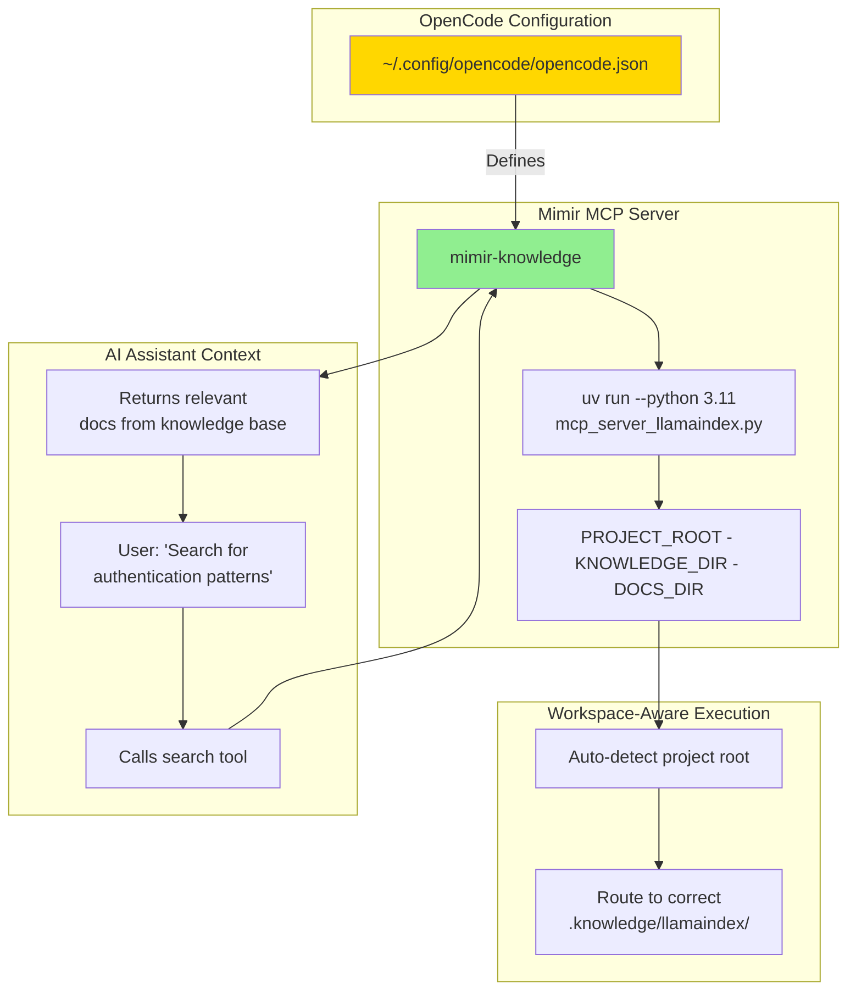

**OpenCode Configuration:**

```json
{
  "mcp": {
    "mimir-knowledge": {
      "type": "local",
      "command": [
        "/Users/ethanwheeler/Documents/Mimir/scripts/run_mcp_server.sh"
      ],
      "environment": {
        "PROJECT_ROOT": "${workspaceFolder}",
        "KNOWLEDGE_DIR": "${workspaceFolder}/.knowledge/llamaindex",
        "DOCS_DIR": "${workspaceFolder}/docs"
      },
      "enabled": true
    }
  }
}
```

**The Magic of `${workspaceFolder}`:**

The `${workspaceFolder}` variable is automatically replaced by OpenCode with the current project path. This means:
- The same MCP server binary serves ALL projects
- Each project gets its own isolated knowledge base
- Zero configuration when switching between projects

---

## File Structure: Understanding the Components

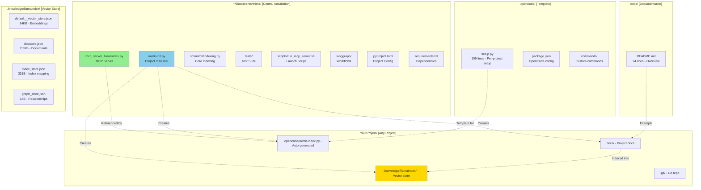

**Key Files Explained:**

| File | Purpose |
|------|---------|
| `mcp_server_llamaindex.py` | Main MCP server with workspace detection, indexing, and query capabilities |
| `mimir-init.py` | Multi-project initializer that creates per-project setup scripts |
| `src/mimir/indexing.py` | Full indexing utilities with cache exclusions |
| `tests/test_workflows.py` | Test suite for LangGraph workflows |
| `scripts/run_mcp_server.sh` | Launch script for MCP server with auto-configuration |
| `.opencode/mimir-index.py` | Auto-generated per-project setup that calls the central server |
| `default__vector_store.json` | Vector embeddings for semantic search |
| `docstore.json` | Original document content and metadata |
| `index_store.json` | Mapping between vectors and documents |

---

## Advanced Features

### 1. Multiple Transport Modes

Mimir supports both stdio (for MCP) and HTTP transports:

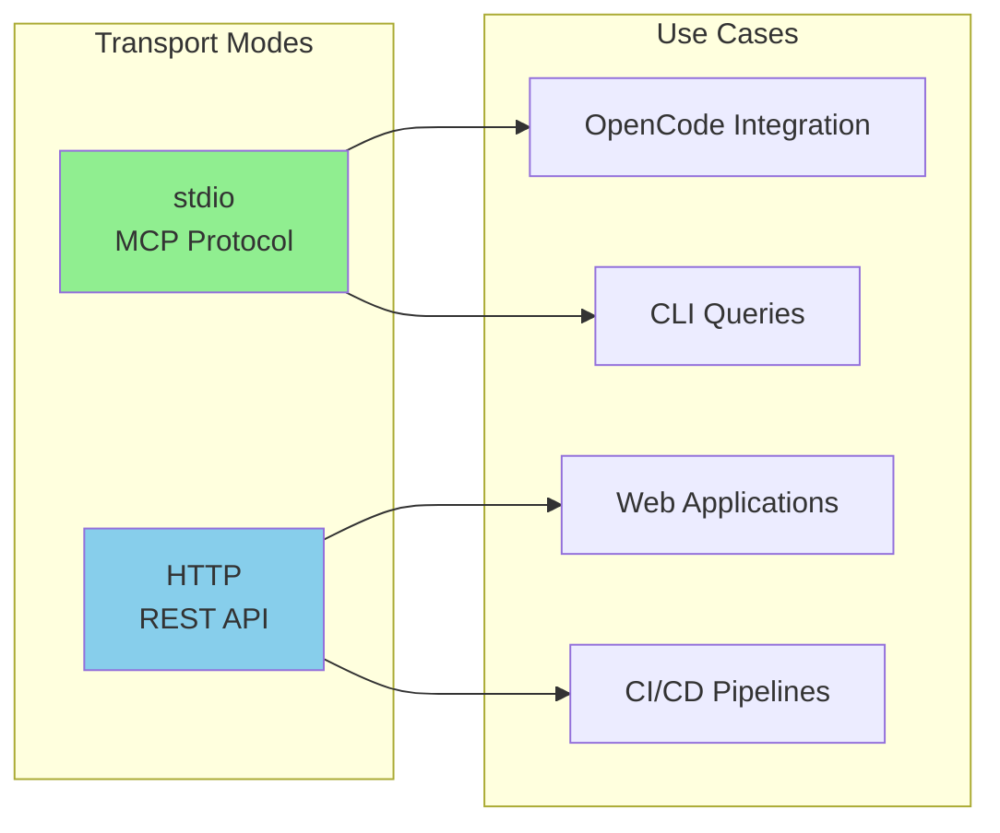

**HTTP Mode:**
```bash
python mcp_server_llamaindex.py --transport http --port 8000
```

### 2. Flexible Configuration

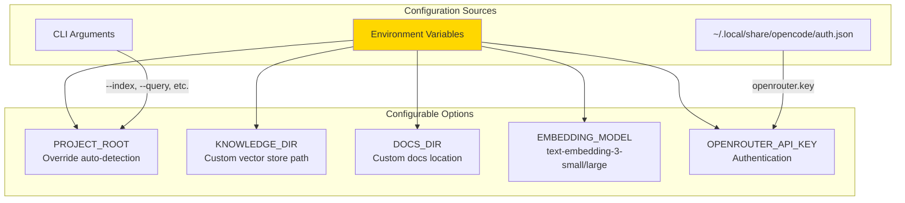

### 3. LangGraph Integration

Mimir includes experimental LangGraph workflows:

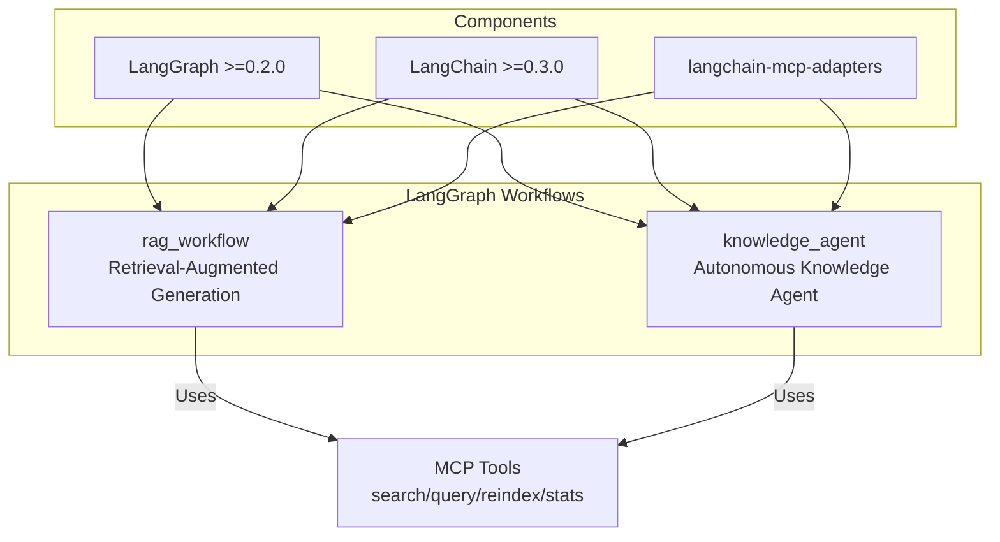

### 4. Web UI

Mimir includes a browser-based interface for visualizing and exploring the knowledge base:

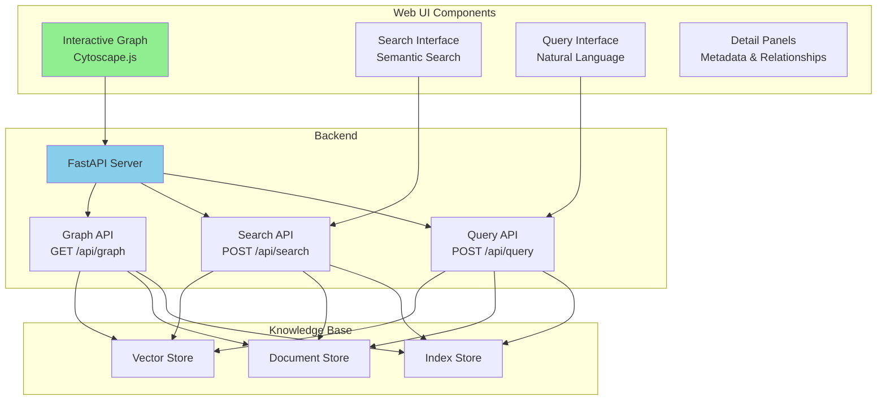

**Features:**
- **Interactive Graph Visualization**: Navigate documents as nodes with relationship edges
- **Multiple Layouts**: Force-directed, circle, grid, and hierarchical views
- **Search & Query**: Full semantic search and natural language querying
- **Detail Panels**: Inspect document metadata and relationships
- **Real-time Updates**: Live graph updates as knowledge base changes

**Usage:**
```bash
python ~/Documents/Mimir/scripts/start_web_ui.sh
# Open http://localhost:8000
```

### 5. Knowledge Graph Relationship Extraction

Mimir includes a hybrid approach to extracting relationships from your codebase:

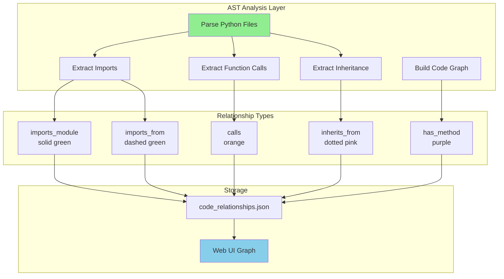

**How it works:**
1. **AST Parsing**: Python's `ast` module parses source code without execution
2. **Import Extraction**: Identifies `import x` and `from x import y` statements
3. **Inheritance Tracking**: Maps class inheritance hierarchies
4. **Call Graph**: Records which functions/methods call others
5. **Visualization**: Web UI renders relationships as colored edges

**Generate the knowledge graph:**
```bash
python ~/Documents/Mimir/src/mimir/knowledge_graph.py
```

**Example output:**
```json
{
  "relationships": [
    {
      "source": "web/server.py",
      "target": "fastapi.FastAPI",
      "relation_type": "imports_from",
      "metadata": {"line": 9, "module": "fastapi"}
    },
    {
      "source": "src/mimir/indexing.py",
      "target": "llama_index.core.VectorStoreIndex",
      "relation_type": "imports_from",
      "metadata": {"line": 58}
    }
  ]
}
```

**Visual indicators in Web UI:**
- **Green (solid)**: Direct module imports
- **Green (dashed)**: Specific imports from modules
- **Orange**: Function/method calls
- **Pink (dotted)**: Class inheritance
- **Purple**: Class-to-method relationships
- **Gray diamonds**: External modules

---

## Comparison: Mimir vs. Alternatives

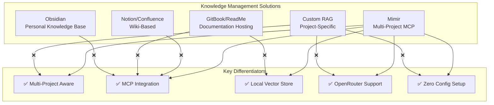

| Feature | Mimir | Wikis | Doc Hosts | Obsidian | Custom RAG |
|---------|-------|-------|-----------|----------|------------|
| Multi-project context | ✅ | ❌ | ❌ | ❌ | Manual |
| MCP/AI integration | ✅ | ❌ | ❌ | ❌ | Build it |
| Semantic search | ✅ | ❌ | ❌ | Limited | ✅ |
| Local/self-hosted | ✅ | ❌ | ❌ | ✅ | ✅ |
| OpenRouter embeddings | ✅ | ❌ | ❌ | ❌ | Manual |
| One-command setup | ✅ | ❌ | ❌ | ❌ | ❌ |
| Works with any project | ✅ | ❌ | ❌ | ❌ | Per-project |

---

## Getting Started

### Installation

```bash
# Clone or copy Mimir to a central location
mkdir -p ~/Documents/Mimir
cd ~/Documents/Mimir

# Install dependencies
pip install -r requirements.txt
# Or use uv
uv pip install -r requirements.txt
```

### Initialize a New Project

```bash
cd ~/Documents/YourProject
python ~/Documents/Mimir/mimir-init.py

# Creates:
#   - docs/           # Add your documentation
#   - .knowledge/llamaindex/  # Vector index storage
#   - .opencode/mimir-index.py      # Auto-generated setup
```

### Add and Index Documents

```bash
# Add documentation
echo "# My Project Docs" > docs/README.md

# Index them
python .opencode/mimir-index.py
```

### Query Your Knowledge Base

```bash
# CLI query
python ~/Documents/Mimir/mcp_server_llamaindex.py --query "How does authentication work?"

# Get stats
python ~/Documents/Mimir/mcp_server_llamaindex.py --stats

# Rebuild index
python ~/Documents/Mimir/mcp_server_llamaindex.py --reindex
```

### Indexing Your Source Code

By default, Mimir only indexes your `docs/` directory. But you can also index your source code to enable semantic code search. Mimir uses a per-project configuration file (`.mimir/config.json`) so each project can have its own settings:

**During setup:**
```bash
python ~/Documents/Mimir/mimir-init.py --code-dirs=src,tests
```

**Or manually create `.mimir/config.json`:**

```json
{
  "docs_dir": "docs",
  "code_dirs": ["src", "tests", "lib"],
  "knowledge_dir": ".knowledge/llamaindex",
  "embedding_model": "text-embedding-3-small"
}
```

**Then reindex:**
```bash
python ~/Documents/Mimir/mcp_server_llamaindex.py --reindex
```

**Now you can search your code:**
```
"Find where authentication middleware is defined"
"How does error handling work in the utils module?"
"Show me all database query functions"
"What files import the Config class?"
```

**Why a config file?**
- **Per-project settings**: Each project has its own `.mimir/config.json`
- **No environment juggling**: Switch projects without changing env vars
- **Version controlled**: Commit config to git so your team shares the same settings
- **Simple**: Just JSON, no complex syntax

**How it works:**
1. Server starts and looks for `.mimir/config.json` in the project root
2. If found, it reads `code_dirs` (array of directory paths)
3. Each directory is recursively indexed along with `docs/`
4. Source files are chunked and embedded just like documentation
5. Semantic search finds code by meaning, not just function names

**Priority (highest to lowest):**
1. `.mimir/config.json` - Project-specific settings
2. Environment variables - Override for specific sessions
3. Defaults - `docs/` only, standard paths

**With OpenCode:** The MCP server automatically reads `.mimir/config.json` from your project root—no environment variables needed! Each workspace gets its own configuration automatically.

Now your AI assistant understands both your documentation AND your codebase!

---

## Future Roadmap

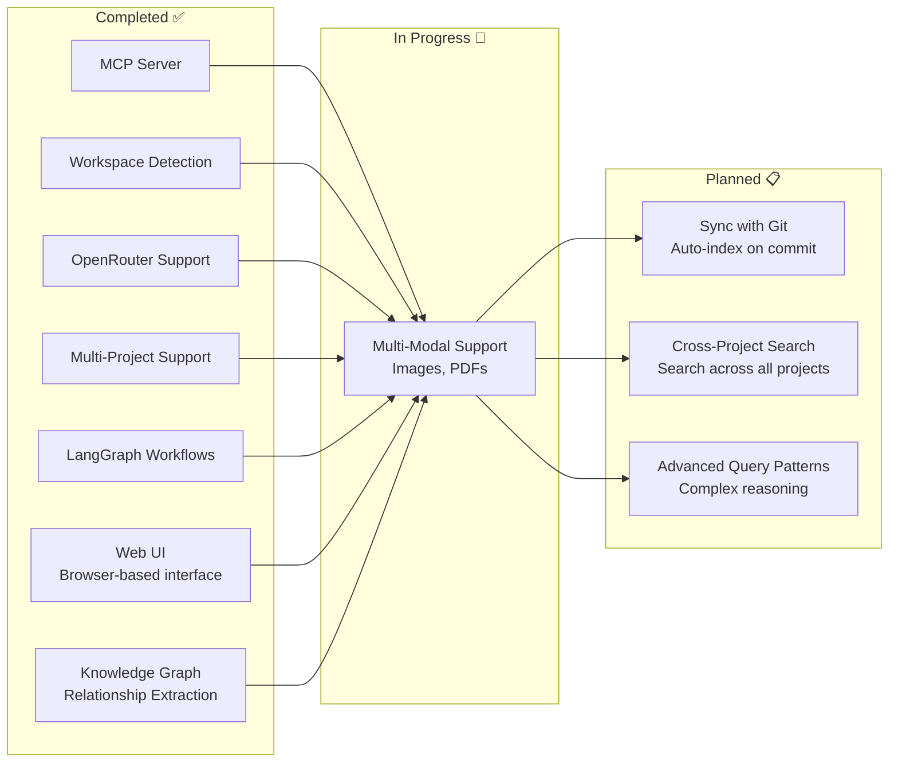

---

## Conclusion

Mimir represents a new approach to knowledge management in multi-project environments. By combining:

- **LlamaIndex** for state-of-the-art semantic search
- **MCP** for standardized AI integration
- **OpenRouter** for accessible embeddings
- **Workspace auto-detection** for zero-configuration setup

...Mimir makes it effortless to maintain rich, searchable knowledge bases across all your projects.

The architecture is designed to be **invisible**: you set it up once, and it just works—wherever you are, whatever project you're working on.

**Key Takeaways:**
1. 🎯 **Centralized server, isolated storage** - One binary serves unlimited projects
2. 🔍 **Semantic search** - Find information by meaning, not just keywords
3. 🤖 **AI-native** - Built for integration with LLMs via MCP
4. ☁️ **OpenRouter support** - No OpenAI key required
5. 🚀 **Zero config** - Auto-detects project context

---

## Resources

- **Repository**: `~/Documents/Mimir/`
- **MCP Server**: `mcp_server_llamaindex.py` (313 lines)
- **Setup Script**: `mimir-init.py` (274 lines)
- **Documentation**: Add files to `docs/` in any initialized project

**Try it yourself:**
```bash
cd ~/Documents/YourProject
python ~/Documents/Mimir/mimir-init.py
echo "# Getting Started" > docs/README.md
python .opencode/mimir-index.py
python ~/Documents/Mimir/mcp_server_llamaindex.py --query "What can I do with this project?"
```

---

*Mimir: Knowledge that follows you, not the other way around.*
